

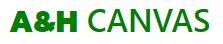

<h1>A&H Canvas</h1>

A&H Canvas is a website built on Django using Python, JavaScript, HTML and CSS. The site is a full B2C ecommerce website for a fictional personal business. The business sells photographic prints in different canvas sizes for wall mounting. Users of the site can search for products via manual keywords search, filter by category or browse through all products available. Users can select different quantities of products in the different canvas buying options and add them to their shopping bag, proceed through a purchase. Users can register for an account to store their information on for easier selction upno next time they check out. Registered users can also see an order history so they can track their orders. The business owner can add, edit and remove products from the site without accessing the admin interface. 

The site provides role based permissions for users to interact with a central dataset. It includes user authentication, email validation, Full CRUD functionality for approved users for editing, adding and deleting Products and Combinations.

<h2 align='center'>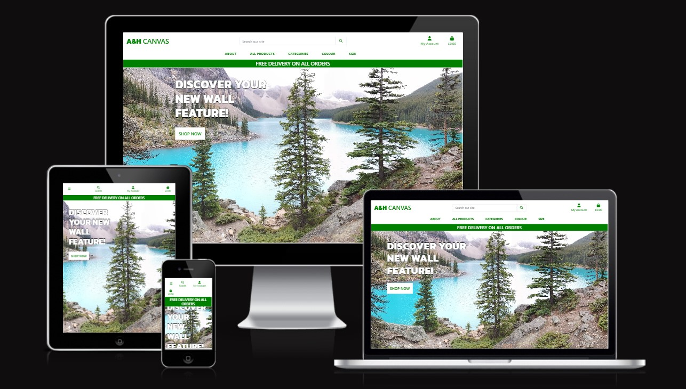</h2>

[View the live project here.](https://www.ahcanvas.heroku.com/)

## User Experiences (UX)

### Overall Goals

- To provide an ecommerce solution for a personal business selling our photography in the form of canvas prints for wall mounting. - B2C
- To maintain and update the site with new content.
- To provide a degree of control over the site.
- To provide users with a simple product selection and purchase experience.

### Stratgy Plane

- A&H Canvas is a business to consumer B2C ecommerce site for users to find and purchase beautifully taken photographs for the purpose of wall mounting them in the form of a canvas, each Photogrpah will have different buying options for the user purchase. For the site owner they are able to manage the site content to keep it up to date. The overall design of the site is intended to provide users with a clean and easy to navigate environment whilst providing the level of detail required for the different products. 

### The Site Ideal Users

- Interior designers search for decorating products for homes or offices.
- Someone decorating their home or office. 
- A photography enthusiast that is looking for inspiring prints.

### User Stories

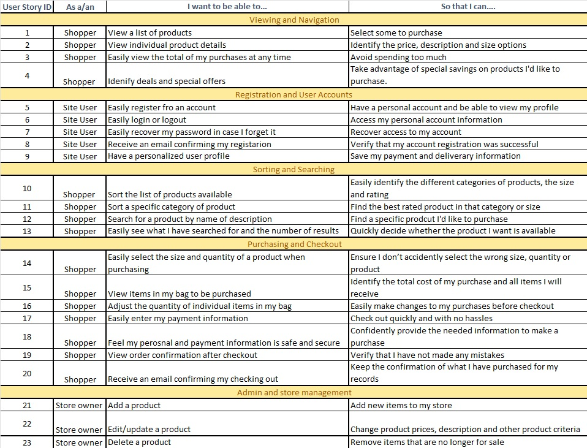

## Functional Scope

### Entity relationship Diagram

### Databases 

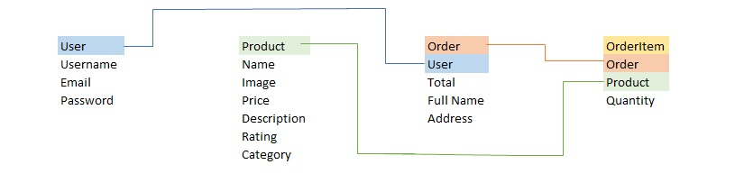

## Structure

### Wireframes
#### Home Page

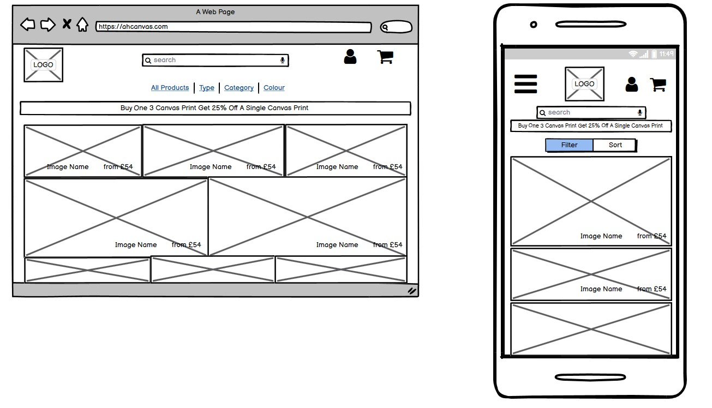

#### Product Details 

### Colour Scheme

- With a lot of the photography centering around landscapes and nature I wanted to keep the colour scheme as simple as possible to let the photographs do the talking on the page. 
- The choice of Green and White was used to promote the nature aspect of the photographs and give them a clear chance to shine through on the page.

### Typography 

- Lato was used for the main font throughout the site as it is clear and easy to read. 
- Kanit was used as the more stylised font for the heading.

### Key Word Research

- Research was conducted to discover the appropiate keywords to utilise given the target markets and product range. This research was based on Google's SEO tools which provides details of common search terms users are search for and allows you to seach these terms by target market. The UK and USA markets were used for example purposes.

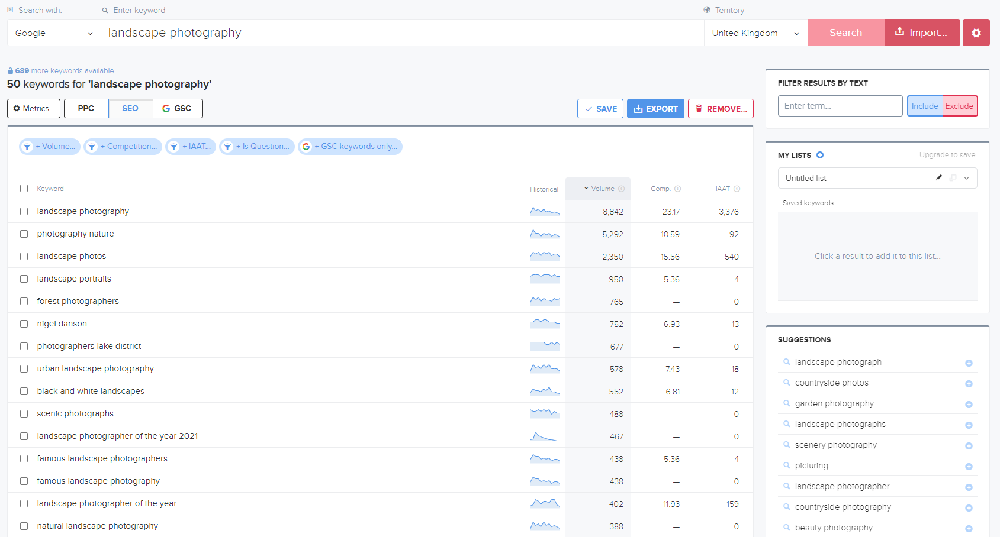Keyword search 'Landscape Photography' - UK

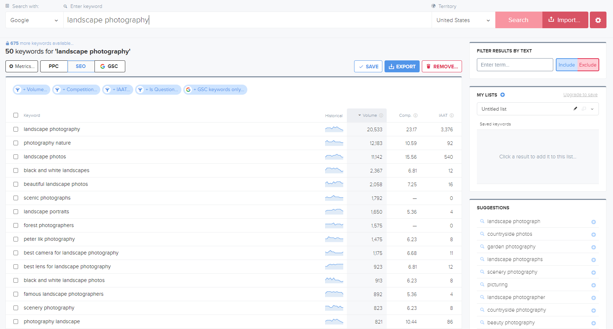Keyword search 'Landscape Photography' - USA

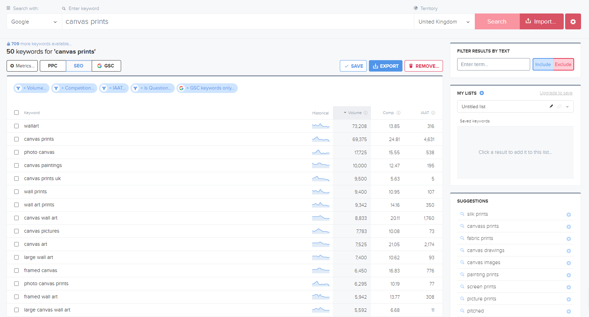Keyword search 'Canvas Print' - UK

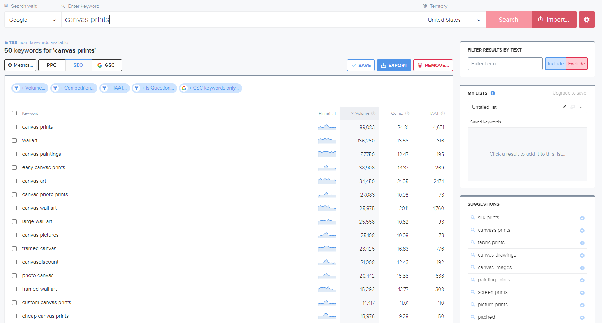Keyword search 'Canvas Print' - USA

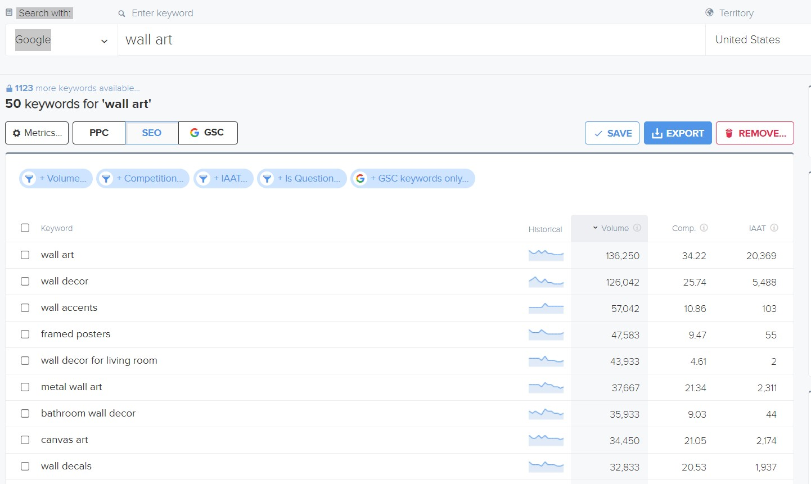Keyword search 'Wall Art' - UK

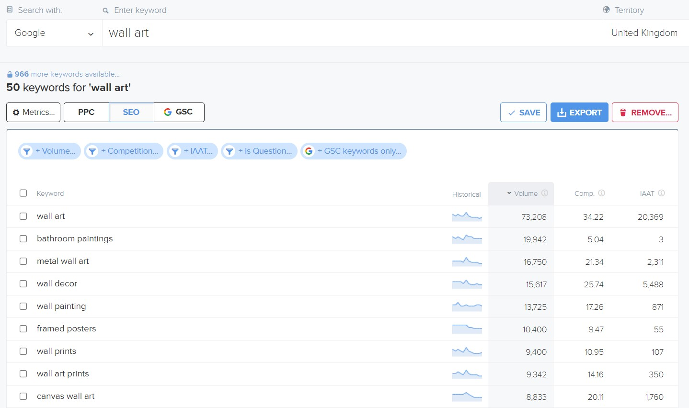Keyword search 'Wall Art' - USA

- From this research a refined keyword list was cultivated for use with the short-tail keywords within the head meta tags and for content through out the site. However this only formed a small part of the overall strategy for the sites SEO strategy.

### Content Strategy 

The main foundation for the sites SEO strategy was to provide a platform for the company from which they can provide users with informative and relevant information. Product pages were designed to include more details that the average product page - which enables the company to configure the descriptions in a manner that maximises the SEO value.

### Social Media Marketing
For the purposes of the assessment a Facebook page was created for the company. As a key foundation for any ecommerce website's marketing strategy social media would form a key part of the businesses marketing strategy. The page included links to the main website to drive traffic from the social network to the site. Content for this page will include post about where new photos will be taken.

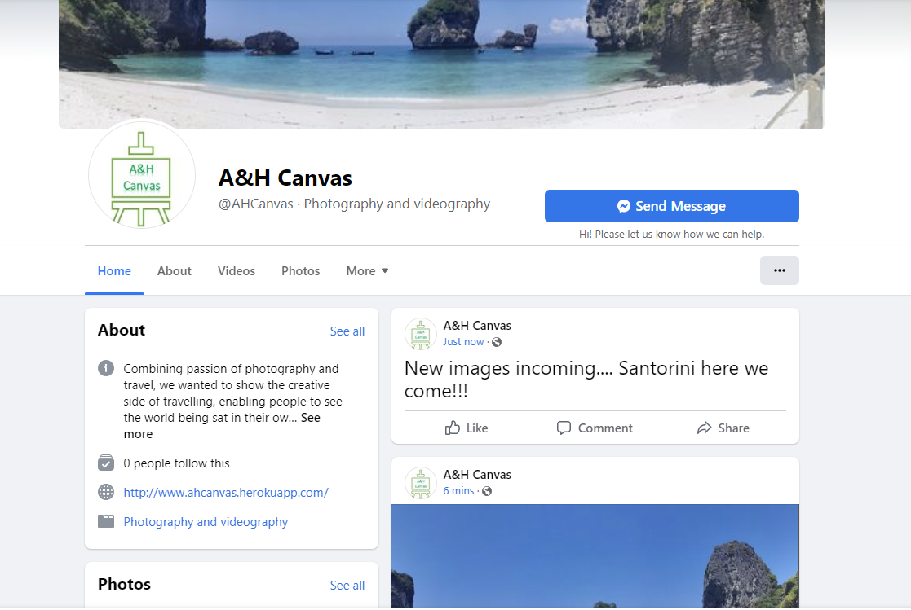

### Testing 

I utilised a manual testing strategy for the development of the site. A full detailed breakdown of the testing procedures can be found in the TESTING.md file [here](/workspace/AHcanvas_v1/TESTING.md). Seperate to the functionality testing of the site, and the testing of the code, User Story tests were implemented to ensure that the acceptance criteria of the user stories listed above were met.

### User Story Testing 

### Further Testing
- The website was tested on Google Chrome, Microsoft Edge and Safari browsers.
- The website was viewed on a variety of devices such as desktop, laptop, Android phones, iPhones and Andriod tablets.
- A large amount of testing was done to ensure that all pages were linking correctly.
- Friend, Family and Peers were asked to review the site and point out any bugs and/or user experience issues

### Lighhouse Testing 

## Project Bugs and Solutions

## Features
### Navigation
The main navigation is split into three sections. The first section contains the main navigation for the sites main sections of interest. The second section contains the links for user account management or employee site management. The third is the search bar that lets the user search keywords on the site.

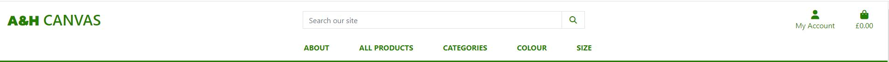

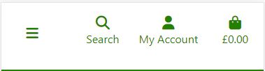

#### Footer
There are also navigation links within the footer from which users can access areas of the site and social media links. Also included in the footer is a newsletter sign up to a mailchimp controlled email database. The mailchimp supplied sign up form was styled to match the remainder of the site. 

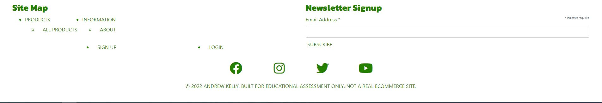

#### Homepage
The homepage greets users with a welcome message over one of the photos that you can purchase. The clear links within the navigation bar indicate that the site is a shop and the shop now button is bold and easy to see. 

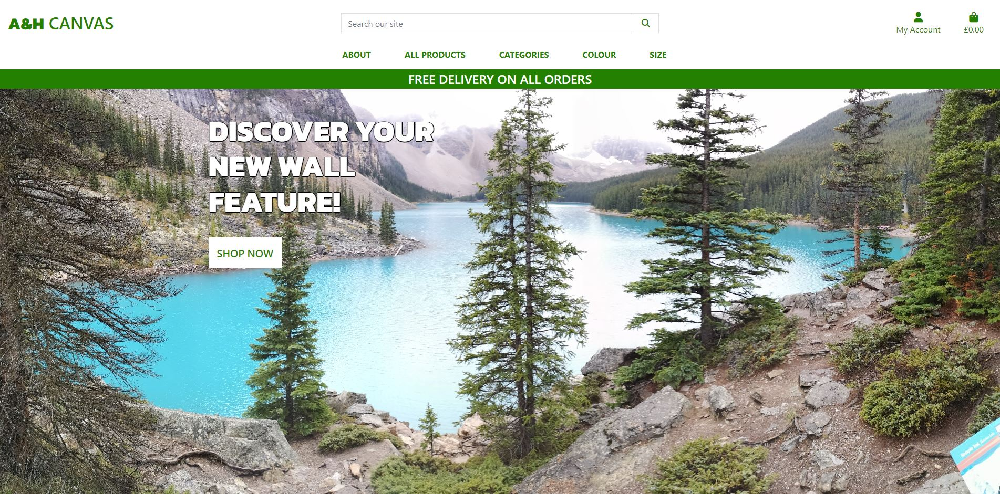

#### All Products
The all products page displays a a card featuring the image and title with the price and rating of the product. The page is made up of 12 products, pagination was utilised to create multiple pages of the full list of products. There is also a return to top button so the user can get back to the sort selector at the top. The sort selector give the user the option to rearrange the products are displayed based on name, rating, category and colour.

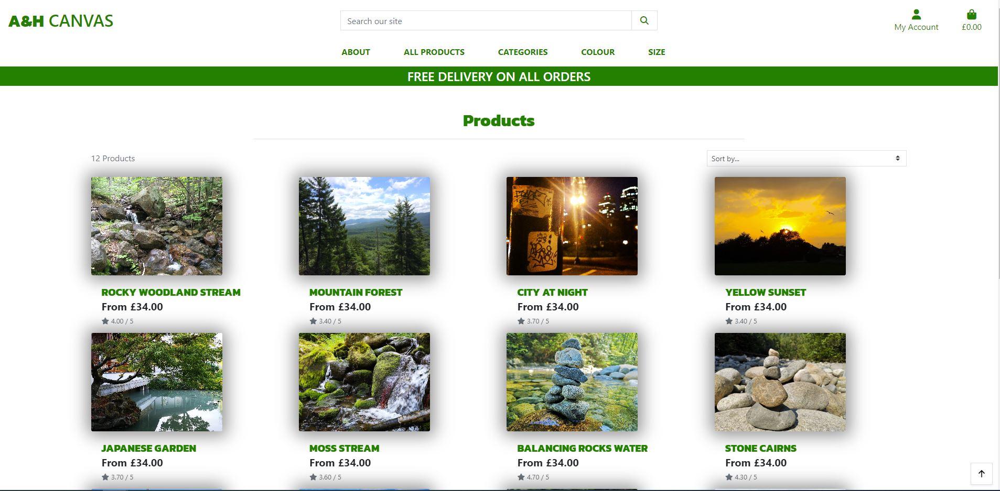

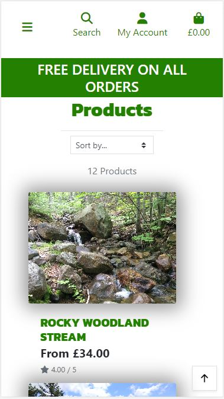

#### Product Details
The products details page has a header and a larger version of the image from the card and if clicked the imge opens up full size in a new browser window. Along with this there are two main sections to this page. The product information which holds the description, name, rating and category. The category is a clickable link that will filter all product of the same category. The second section is the buying opions where you can select the quantity that you would like to purchase and in what buying option you would like. 

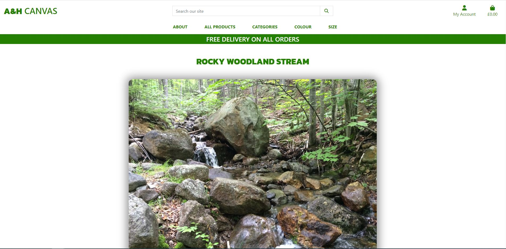

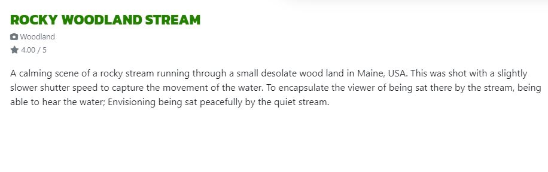

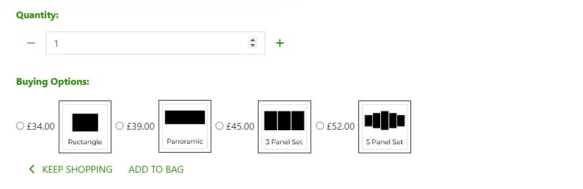

#### Bag
When the user has selected the quantity and buying option it can be added to the bag. The bag is displayed in the nav bar. When adding items to the bag a message will appear with a summary of the bag information including the name, image, buying option, quantity and price. This pop up can be cleared to continue shopping with the 'x' or can be used to got to the checkout. If  the user selects the bag icon this will take the user to their bag. The bag has the same layout to the message pop up with the same information included. Here the user can adjust the quantity of the items in the bag and remove items if they want. 

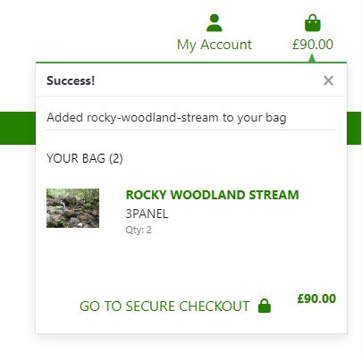

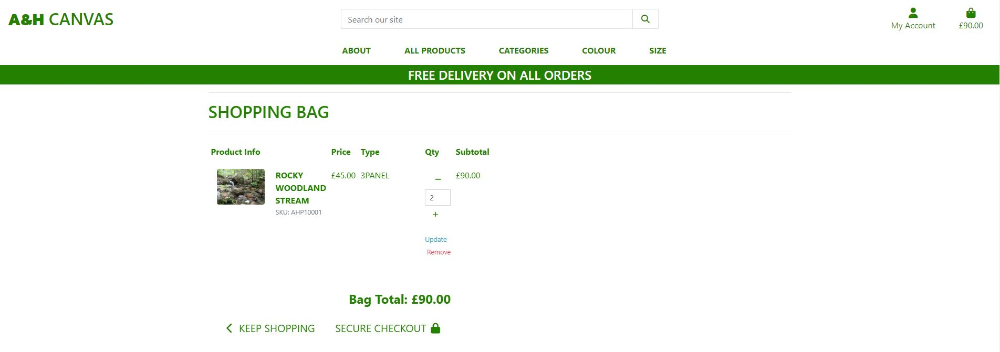

## Technologies Used
 - Python
    - The following Python modules were used on this project:
        - asgiref==3.5.2
        - async-generator==1.10
        - backports.zoneinfo==0.2.1
        - botocore==1.27.62
        - click==8.1.3
        - dj-database-url==1.0.0
        - Django==4.1
        - django-allauth==0.51.0
        - django-countries==7.2.1
        - django-crispy-forms==1.14.0
        - django-email==0.1.10
        - django-smtp-ssl==1.0
        - django-storages==1.13.1
        - gunicorn==20.1.0
        - h11==0.13.0
        - jmespath==1.0.1
        - oauthlib==3.2.0
        - outcome==1.2.0
        - pathspec==0.9.0
        - Pillow==9.2.0
        - psycopg2-binary==2.9.3
        - PyJWT==2.4.0
        - pyOpenSSL==22.0.0
        - PySocks==1.7.1
        - python3-openid==3.2.0
        - pytz==2022.1
        - requests-oauthlib==1.3.1
        - s3transfer==0.6.0
        - selenium==4.3.0
        - sniffio==1.2.0
        - sortedcontainers==2.4.0
        - sqlparse==0.4.2
        - stripe==4.1.0
        - trio==0.21.0
        - trio-websocket==0.9.2
        - wsproto==1.1.0

- Django
    - Django was used as the main Python framework in the development of this project.
    - Django AllAuth was utilised to rpovide enhanced user account management functionality. 

- Heroku
    - Was used as the cloud based platform to deploy the site on.

- Heroku PostgreSQL
    - Was used as the database for the project during development and in production.

- JavaScript
    - Custom JavaScript was utilised to enable the pagination of the products page, Country selection in the profiles, quantity selector for products to add to the bag and in the bag, Mailchip functionality, Stripe functionality and selecting combinations on the edit combination page.

- Bootstrap 5.2
    - Bootstrap was used for general layout and spacing requirements for the site.

- Font Awesome
    - Was used for access to several icons for different sections where icons were appropriate.

- CSS
    - Custom css was written for a large number of areas on the site to implement custom styling and escape a bootstrap look and feel to the site.

- HTML 
    - HTML was used as the base language for the templates created for the site.

### Deploymemt

The site was deployed via Heroku, and the live link can be found here - [A&H Canvas](https://www.ahcanvas.heroku.com/)

#### Project Deployment

To deploy the project through Heroku I followed these steps:

- Sign up / Log in to Heroku
- From the main Heroku Dashboard page select 'New' and then 'Create New App'
- Give the project a name - I entered ahcanvas and select a suitable region, then select create app. The name for the app must be unique.
- This will create the app within Heroku and bring you to the deploy tab. From the submenu at the top, navigate to the resources tab.
- Add the database to the app, in the add-ons section search for 'Heroku Postgres', select the package that appears and add 'Heroku Postgres' as the database
- Navigate to the setting tab, within the config vars section copy the DATABASE_URL to the clipboard for use in the Django configuration.
- Within the django app repository create a new file called env.py - within this file import the os library and set the environment variable for the DATABASE_URL pasting in the address copied from Heroku. The line should appear as os.environ["DATABASE_URL"]= "Paste the link in here"
- Add a secret key to the app using os.environ["SECRET_KEY"] = "your secret key goes here"
- Add the secret key just created to the Heroku Config Vars as SECRET_KEY for the KEY value and the secret key value you created as the VALUE
- In the settings.py file within the django app, import os and import dj_database_url
- Remove the insecure secret key that django has in the settings file by default and replace it with SECRET_KEY = os.environ.get('SECRET_KEY')
- Replace the databases section with DATABASES = { 'default': dj_database_url.parse(os.environ.get("DATABASE_URL"))} ensure the correct indentation for python is used.
- In the terminal migrate the models over to the new database connection
- Navigate in a browser to Amazon AWS, log in, or create an account and log in.
- Create a new S3 bucket for the site and create a static directory and media directory within the bucket.
- From the dashboard - copy the bucket details into the settings file.
    - you will require the following:
        - Storage Bucket Name
        - Storage Bucket Region Name
        - Access Key ID
        - Secret Access Key
    - configure these settings in the settings file
- In the env.py file created earlier
    - add os.environ["AWS_ACCESS_KEY_ID"] = "paste in your access key"
    - add os.environ["AWS_SECRET_ACCESS_KEY"] = "paste in your secret access key"
- In Heroku, add the keys and values copied to the clipboard to the config vars
- Also add the KEY - DISABLE_COLLECTSTATIC with the Value - 1 to the config vars
- This key value pair must be removed prior to final deployment
- Using the requirements.txt file install all of the required packages
- In the Settings.py file - add the STATIC files settings - the url, storage path, directory path, root path, media url and default file storage path.
- Link the file to the templates directory in Heroku TEMPLATES_DIR = os.path.join(BASE_DIR, 'templates')
- Change the templates directory to TEMPLATES_DIR - 'DIRS': [TEMPLATES_DIR]
- Add Heroku to the ALLOWED_HOSTS list the format will be the app name given in Heroku when creating the app followed by .herokuapp.com
- Create a new file on the top level directory - Procfile
- Within the Procfile add the code - web: guincorn PROJECT_NAME.wsgi
- In the terminal, add the changed files, commit and push to GitHub
- In Heroku, navigate to the deployment tab and deploy the branch manually - watch the build logs for any errors.
- Heroku will now build the app for you. Once it has completed the build process you will see a 'Your App Was Successfully Deployed' message and a link to the app to visit the live site.
- This project utilises Stripe as a payment platform provider - You can create a stripe account at www.stripe.com you will need a developer account to gain access to the api keys required to run the payment processes.
- Once you have successfully created your stripe account, insert the stripe public key, stripe secret key and stripe webhook key into the env.py file and the heroku config vars. Configure the settings file to point at the variables required. Stripe provide documentation on how to setup stripe within django which is easy to follow. It is available within the stripe developer site.

### Credits 
#### Media
All images shown on this site are owned and taken by Heather Parris and I. 

#### Acknowledgements
 I'd like to thank the following:
- Narender Singh my mentor for all his help guiding me throught this project
- Matt Bodden how greatly assisted me when I ran out of tutoring time. 
- Alex and Oisin at CI Tutor support for their patience and pointing me in the right direction when I went off course. 