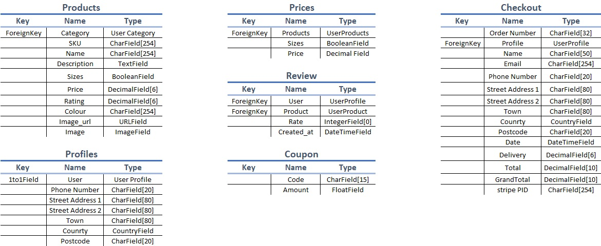

<h1>A&H Canvas</h1>

A&H Canvas is a website built on Django using Python, JavaScript, HTML and CSS. The site is a full B2C ecommerce website for a fictional business. The business sells photographic prints in different canvas sizes for wall mounting. Users of the site can search for products via manual keywords search, filter by category or browse through all products available. Users can select different quantities of products in the different canvas buying options and add them to their shopping bag, proceed through a purchase. Users can register for an account to store their information on for easier selction upno next time they check out. Registered users can also see an order history so they can track their orders. The business owner can add, edit and remove products from the site without accessing the admin interface. 

The site provides role based permissions for users to interact with a central dataset. It includes user authentication, email validation, Full CRUD functionality for approved users for editing, adding and deleting Products and Combinations.

<h2 align='center'></h2>

[View the live project here.](https://www.ahcanvas.heroku.com/)

## User Experiences (UX)

### User Stories

## Functional Scope

### Entity relationship Diagram

### Databases 

## Structure

### Wireframes
#### Home Page

#### Product Details 

