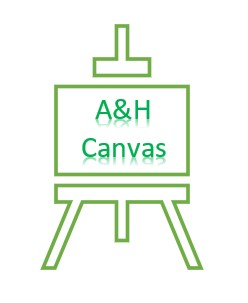

<h1 align='center'>A & H Canvas</h1>

[View the live project here.](link)

This is the E-Commerce website for selling the photographs my partner and I take. It is designed to be a platform where Users can buy Canvas Prints for their homes. 

<h2 align='center'></h2>

## User Experiences (UX)

### User Stories

## Functional Scope

### Entity relationship Diagram

### Databases 

## Structure

### Wireframes
#### Home Page

#### Product Details 

