<h1>Testing</h1>

## Test Case 01
### Python Testing 
The Python code was checked using the pep8 validator available at pep8online.com. No errors were reported by the validator in the files I created. The settings.py file did however contain five line too long errors. Each of these errors related to Django default code pointing to password validation paths or custom css or js files and could not be shortend.

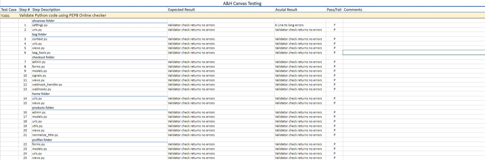

## Test Case 02
### CSS Testing
The CSS was checked using a CSS Validator Site. No errors were reported by the validator.

## Test Case 03
### HTML Testing
Due to the way Django templates include Django template code in them, and extend other templates, it is not possible to copy the code for each page out of the source html files. Therefore, in order to validate the code correctly, I navigated to the site and accessed the rendered html code through the developer tools of the browser I used during development, Google Chrome. I then pasted the code into the HTML validator site available at W3C Markup Validation Service.

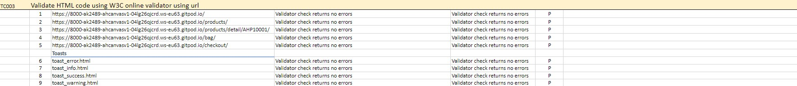

## Test Case 04
### JavaScript Testing 
The JavaScript code was checked using the jshint.com validator available at jshint.com. No errors were detected within the files I created.

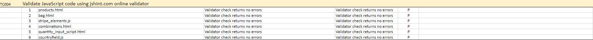

## Test Case 05
### Lighthouse
I used google chromes lighthouse to check the performance, accessibility, best practices and SEO. Due to the site being heavy with images this effects the performance slightly.

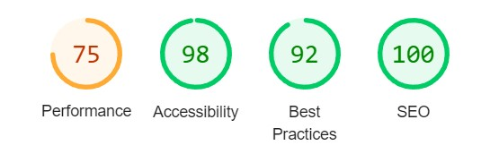

## Test Case 06
### Site Navigation 
I conducted a full test on the site to ensure that every link is working correctly and taking the user to the next part of the site or updating the information if required. All the filters and sort selectors bring up the correct information and the search function finds keyword used in the product details.

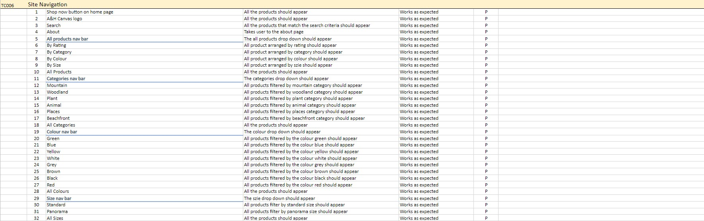

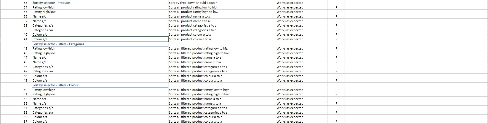

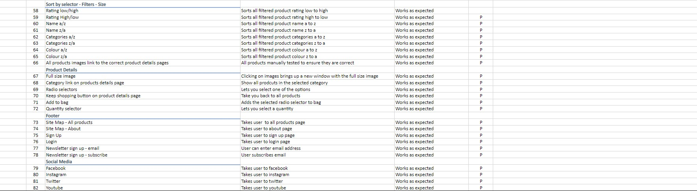

## Test Case 07
### Pagination
I conducted a full test to ensure that the pagination works from the first link to the last and loads up the correct page. I also tested this out on filtered and sorted pages.

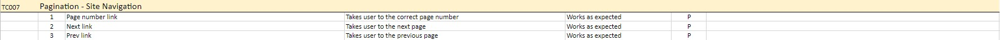

## Test Case 08
### User Accounts 
I conducted a full test to ensure that user accounts work for updating information. Order history shows after a purchase and users can register an account.

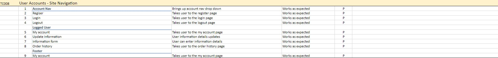

## Test Case 09
### Superuser/Admin 
I conducted a full test to ensure that the superuser account allows the user to edit, delete and add product

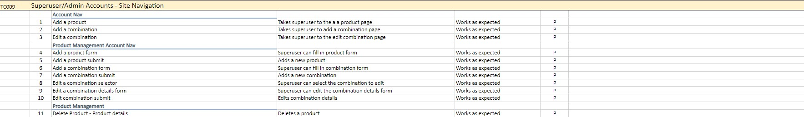

## Test Case 10
### Bag Checkout 
I conducted a full test to ensure that the bag can be edited and goes to the checkout. Then that the checkout completes the transaction. 

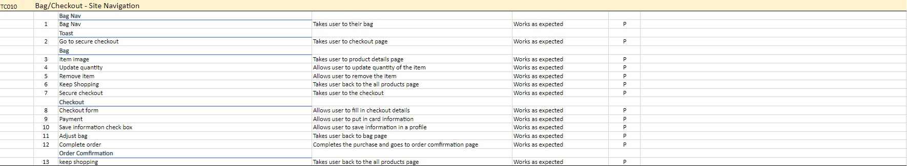

## Test Case 11
### Accounts 
I conducted a full test on the users account to ensure that confirmation emails are sent after registering, and resetting passwords. 

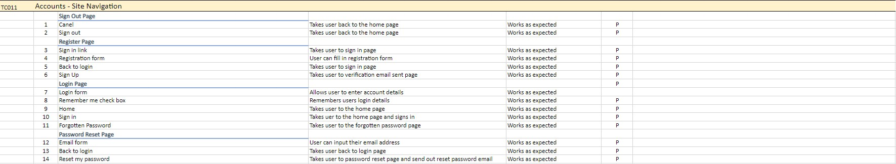